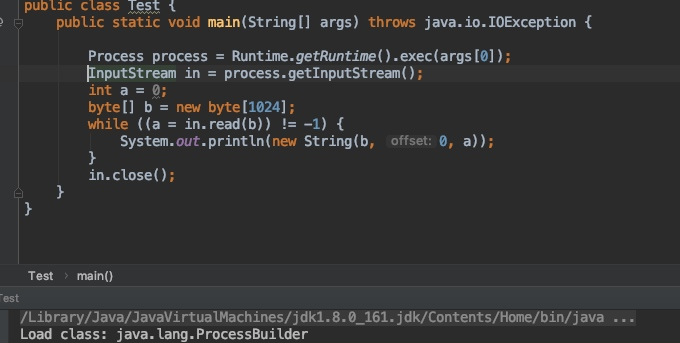
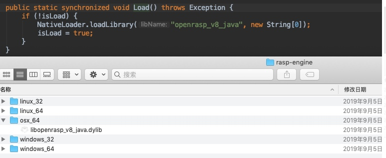
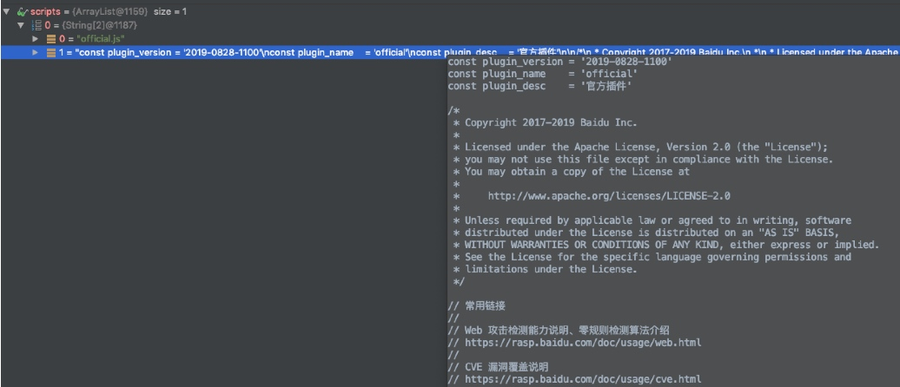
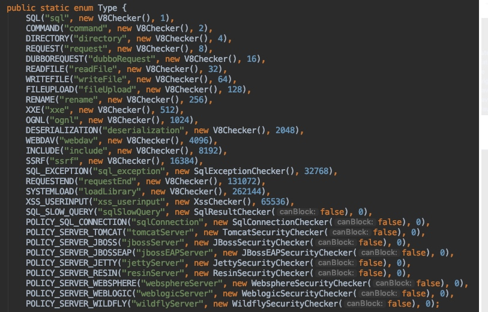
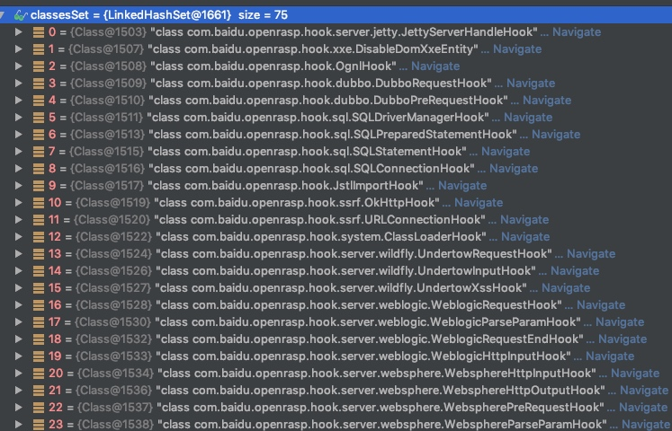
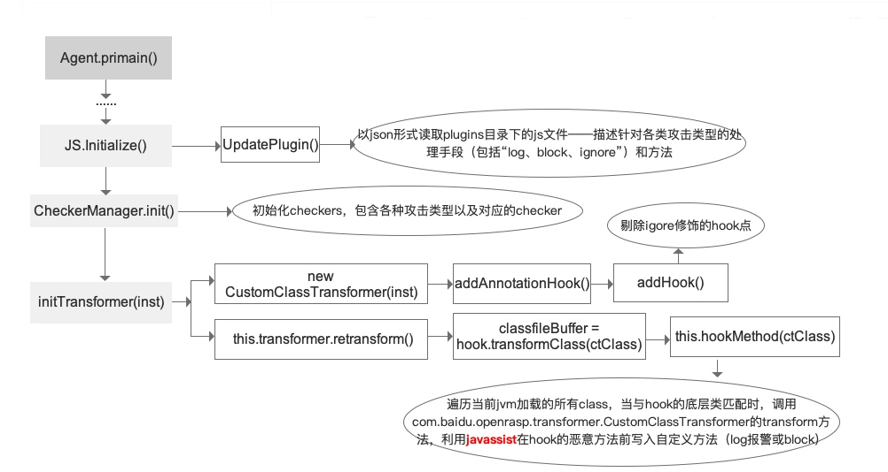

# Java RASP Hook技术原理分析

## 关于rasp
在2014年的时候，Gartner引入了“Runtime application self-protection”一词，简称为RASP。它是一种新型应用安全保护技术，RASP技术可以快速的将安全防御功能整合到正在运行的应用程序中，它拦截从应用程序到系统的所有调用，能实时检测和阻断安全攻击，使应用程序具备自我保护能力。

*官方的rasp技术图*


## rasp技术实现原理

对危险的底层函数进行hook。当HOOK住的危险函数被调用之后，触发检测逻辑。
Rasp技术的本质就是如何实现这样一个HOOK动作的agent。
java中，通过java agent的方式进行实现。
### javaagent加载机制

在jvm启动的时候可通过-javaagent参数来执行agent代理。agent代理运用instrument技术，可直接修改jvm中加载的字节码的内容。
*修改字节码的技术*（asm、javassist rasp使用javassist）
- 简单的Agent
通常agent的包里面MATE-INF目录下的**MANIFEST.MF**中会通过“**Premain-Class**:”声明Agent类：
```
Manifest-Version: 1.0
Premain-Class: cn.org.javaweb.agent.Agent
Can-Retransform-Classes: true
Can-Redefine-Classes: true
Can-Set-Native-Method-Prefix: true
```
**Agent.class**

```
import java.lang.instrument.Instrumentation;
public class Agent {
    public static void premain(String agentArgs, Instrumentation inst) {
        inst.addTransformer(new AgentTransform());
    }
}
```
**AgentTransform.class**
```
import java.lang.instrument.ClassFileTransformer;
import java.lang.instrument.IllegalClassFormatException;
import java.security.ProtectionDomain;
import org.objectweb.asm.*;
public class AgentTransform implements ClassFileTransformer{
    @Override
    public byte[] transform(ClassLoader loader, String className,
                            Class<?> classBeingRedefined, ProtectionDomain protectionDomain,
                            byte[] classfileBuffer) throws IllegalClassFormatException {
        className = className.replace("/", ".");
        try {
            if (className.contains("ProcessBuilder")) {
                System.out.println("Load class: " + className);
            }

        } catch (Exception e) {
            e.printStackTrace();
        }

        return classfileBuffer;
    }
}
```


## 跟踪rasp代码分析加载的agent做了哪些工作

- 加载原生类库


- 加载插件
以json形式读取plugins目录下的js插件文件，其中描述了针对各种攻击类型的处理方法和手段（包括“log，block，ignore”）等
如官方插件official.js

- 初始化checkers
包含各种攻击类型以及对应的checker

*其中V8Checker是原生库代码*

- initTransformer(inst)——agent的核心工作区
这里做了两件事：
1. 根据前面加载的js插件文件标记出hook点（即根据攻击类型标记的危险的底层方法），剔除js文件中“ignore”修饰的hook点

在java rasp的样例中，包含以下75种hook类型（sql注入、文件写入、weblogic反序列化等）


2. 利用javassist技术修改字节码
   遍历当前jvm加载的所有class，当与hook的类匹配时，调用com.baidu.openrasp.transformer.CustomClassTransformer的transform方法，利用javassist在hook的恶意方法前写入自定义方法（log或block操作）
   

**整个流程图如下**


## 利用rasp报警漏洞实际案例

### 攻击类型：命令执行（command_userinput）

js插件种定义如下：

与之相对应的Hook类为com.baidu.openrasp.hook.system.ProcessBuilderHook
调用com.baidu.openrasp.hook.system.ProcessBuilderHook的hookMethod方法，通过javassist修改原字节码：

**hook成功**


**rasp可自定义插件，具体可参考[官方文档](https://rasp.baidu.com/doc/install/compat.html)**
## rasp目前支持安装在Weblogic、jetty服务器、tomcat服务器中

参考：
https://rasp.baidu.com/doc/install/software.html
https://zhuanlan.zhihu.com/p/27826357
https://www.freebuf.com/articles/web/197823.html


